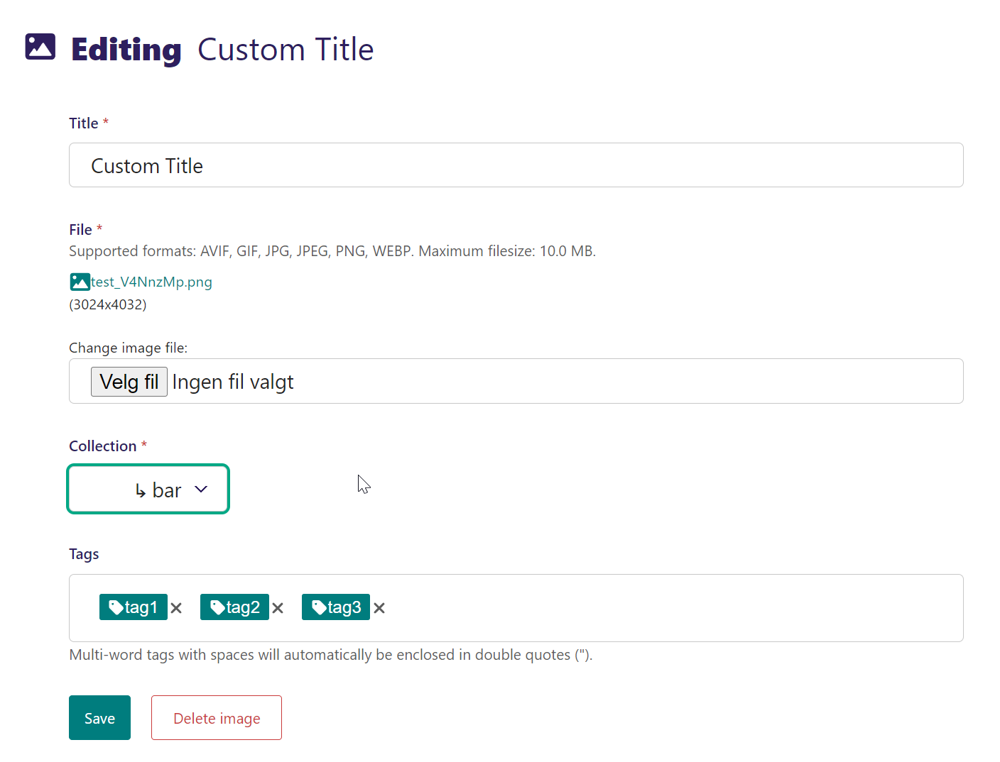
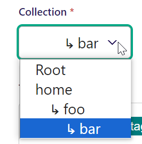

***********************
Wagtail Image Uploader
***********************

Wagtail Image Uploader is a small package to provide an easy to use API for uploading images to a Wagtail site in code.

Features
--------

* Single entry point for uploading images, protected by a long-ass access key generated for each user.

Current status
--------------

* Version : 0.1.0
* Status: alpha/proof-of-concept

Tested with
------------

* Python version 3.12.2
* Django version 5.0.2
* Wagtail version 6.0.1

Installation
------------

Clone main repository:

.. code-block:: bash

    $ git clone https://github.com/weholt/wagtail-image-uploader.git
    $ cd wagtail-image-uploader
    $ pip install .

Or

.. code-block:: bash

    $ pip install git+https://github.com/weholt/wagtail-image-uploader.git

Add image uploader at the top of your installed apps:

.. code-block:: bash

    INSTALLED_APPS = [
        "image_uploader",
    ]

Add *path("", include("image_uploader.urls")),* to your urls.py.

Create superuser allowed to upload images using the API:

.. code-block:: bash

    $ python manage.py migrate
    $ python manage.py createsuperuser

Generate an upload API key for a given user by using the management command:

.. code-block:: bash

    $ python manage.py get_upload_key <username>

Copy the key printed on the screen and add it to your settings.py, similar to below:

.. code-block:: bash

    IMAGE_UPLOADER = {
        'API_KEY': "<your API key>",
        'PRE_PROCESSORS': ["image_uploader.processors.pre_processor.DummyPreProcessor"],
        'POST_PROCESSORS': [
            "image_uploader.processors.post_processor.AssignTitleFromMetadataPostProcessor",
            "image_uploader.processors.post_processor.AssignTagsFromMetadataPostProcessor",
            "image_uploader.processors.post_processor.AssignCollectionFromMetadataPostProcessor"
        ]
    }

Basic Usage
-----------

.. code-block:: bash

    Python 3.12.2 (tags/v3.12.2:6abddd9, Feb  6 2024, 21:26:36) [MSC v.1937 64 bit (AMD64)] on win32
    Type "help", "copyright", "credits" or "license" for more information.
    (InteractiveConsole)
    >>> from image_uploader.services import UploadService
    >>> us = UploadService()
    >>> us.upload_file(
        url="http://localhost:8000/upload-image",
        filename="test.png",
        title="Custom title",
        tags=["tag1", "tag2", "tag3"],
        collections="home/foo/bar"
    )

The title of the image is set, the tags are added and collections are created:

